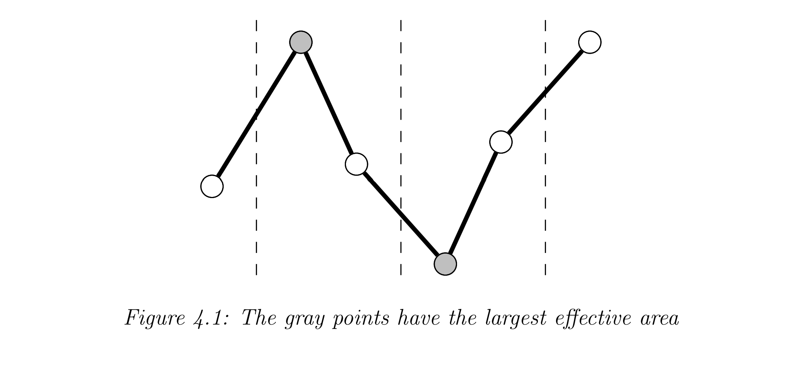
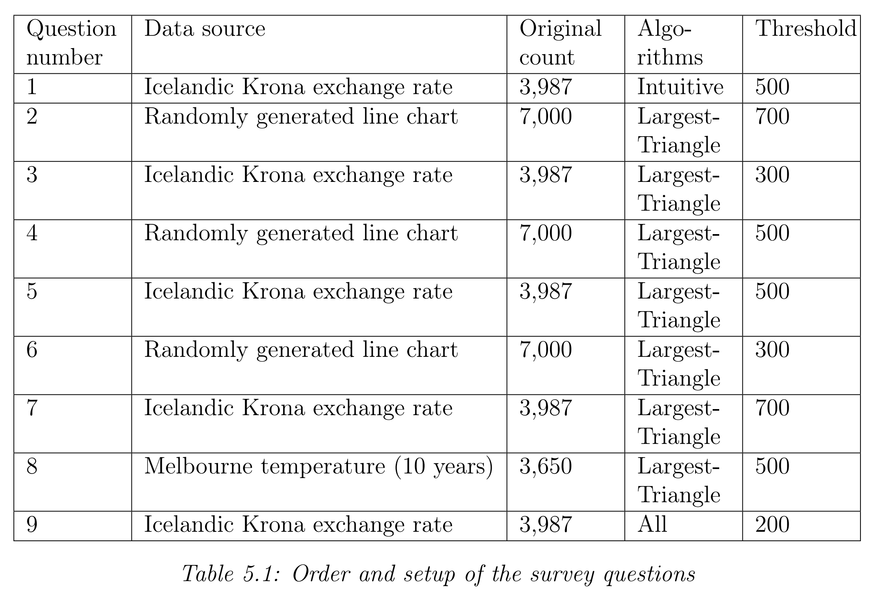

# DOWNSAMPLING TIME SERIES FOR VISUAL REPRESENTATION

## 摘要
As human beings, we often wish to visualize certain information in order to make
better sense of it. This can be a somewhat challenging enterprise for large amounts of
data and might require downsampling the data, retaining only the important visual
characteristics. The focus of this thesis is to explore methods for downsampling data
which can be visualized in the form of a line chart, for example, time series. Several
algorithms are put forth in the thesis and their features are discussed. Also, an online
survey was conducted where participants were asked to compare downsampled line
charts against a non-downsampled chart. Some of the algorithms are based on
a well-known technique in cartography which involves forming triangles between
adjacent data points and using the area of the triangles to determine the perceptual
importance of the individual points. According to the survey, algorithms based on
a triangle area approach consistently proved to be effective, and one in particular
when efficiency is also taken into account
作为人类，我们常常希望将某些信息形象化，以便更好地理解它。
对于大量数据来说，这可能是一个有点挑战性的企业， 可能需要对数据进行下采样，
只保留重要的视觉特征。本论文的重点是探索对可以折线图形式可视化的数据进行下采样的方法，
例如时间序列。论文提出了几种算法并讨论了它们的特点。此外，还进行了一项在线调查，
要求参与者将降采样折线图与非降采样图表进行比较。一些算法基于制图学中众所周知的技术，
该技术涉及在相邻数据点之间形成三角形，并使用三角形的面积来确定各个点的感知重要性。
根据调查，基于三角形区域方法的算法一直被证明是有效的，尤其是在考虑效率的情况下

## Introduction (what)
### 1.1. Motivation (why 动机)
One of the most common type of data visualization used is a line chart. Such
a chart is normally derived from discrete two-dimensional data in which for every
independent value on the x-axis there is one dependent value on the y-axis. If values
on the x-axis are evenly spaced over time, the data is most often referred to as a
time series.
Generally, producing a line chart on a computer is a relatively easy thing to do.
However, if the data contains a vast number of data points, the resulting line chart
may appear quite squashed.
Figure 1.1: Time series containing 10,000 data points
Such an effect is the result of rendering data containing many more points than
the number of pixels for the given canvas width. A line chart entailing a data point
distribution high in density proffers limited information to an observer of that chart.
Short term directions and fluctuations can be hard to determine due to the fact that
multiple values of the dependent variable are drawn on the same vertical pixel line.
For example, if 10,000 data points are drawn on a relatively small canvas, as seen
in figure 1.1, we end up with this type of squashed line chart
最常用的数据可视化类型之一是折线图。这样的图表通常源自离散的二维数据，
其中对于 x 轴上的每个独立值，y 轴上都有一个相关值。
如果 x 轴上的值随时间均匀分布，则数据通常称为时间序列。
通常，在计算机上制作折线图是一件相对容易的事情。
但是，如果数据包含大量数据点，则生成的折线图可能会显得非常压扁。

图 1.1：包含 10,000 个数据点的时间序列 
这种效果是渲染包含比给定画布宽度的像素数更多的点的数据的结果。
包含高密度数据点分布的折线图向该图表的观察者提供的信息有限。
由于因变量的多个值绘制在同一垂直像素线上，因此很难确定短期方向和波动。
例如，如果在相对较小的画布上绘制 10,000 个数据点，
如图 1.1 所示，我们最终会得到这种压扁的折线图

Some necessary steps must be taken to avoid the problems discussed before, when
visualizing a large amount of data as a line chart, if it is preferred or required to
view the chart in its entirety. With some data it might be acceptable to average
out some data points, creating new data points to represent a group of points in
the original data. To achieve this, numerous well-known methods can be applied,
e.g., regression analysis. However, the focus of this thesis is mainly to explore
downsampling algorithms which return a subset of data points existing in the original
data. In that regard, sometimes it might suffice to use only every other data point
or maybe every tenth data point, depending on the data and canvas size. Still,
such a method is only suitable if the data is “smooth” in nature and has little or
no fluctuations. If the data is somewhat irregular, then using only every nth data
point to draw the line chart will almost guarantee that many interesting peaks and
troughs will not be included in the chart, as seen in figure 1.2. Clearly a more
intelligent approach is needed and that is the motivation for this thesis.
(a) Original line chart (b) Downsampled line chart
Figure 1.2: A line chart before and after downsampling with an every nth-point
algorithm
Initially the company DataMarket, inc.1
suggested that I could make the problem
of downsampling data for better visualization the main topic of my masters thesis.
The company has experienced this problem first hand in a very practical manner
since it offers data visualization solutions to their clients.

必须采取一些必要的步骤来避免之前讨论的问题，当将大量数据可视化为折线图时，
如果首选或需要查看整个图表。对于某些数据，可能可以接受对某些数据点进行平均，
创建新的数据点来表示原始数据中的一组点。
为了实现这一点，可以应用许多众所周知的方法，例如回归分析。
然而，本文的重点主要是探索下采样算法，该算法返回原始数据中存在的数据点的子集。
在这方面，有时仅使用每隔一个数据点或每隔 10 个数据点就足够了，具体取决于数据和画布大小。
尽管如此，这种方法仅适用于数据本质上“平滑”且波动很小或没有波动的情况。
如果数据有些不规则，那么只用每第n个数据点绘制折线图几乎可以保证图表中不会包含许多有趣的波峰和波谷，
如图1.2所示。显然需要一种更智能的方法，这就是本文的动机。

(a) 原始折线图 (b) 降采样折线图 图 1.2：每 n 点算法降采样前后的折线图 
最初公司 DataMarket, inc.1 建议我可以将降采样数据的问题进行更好的可视化我硕士论文的主题。
自从该公司为客户提供数据可视化解决方案以来，该公司以非常实际的方式亲身经历了这个问题。

### 1.2. Objectives of the Current Study (目标)
Before stating the objectives it it is important to emphasize that the downsampled
data is only intended to visually represent the original data for human observation
and not data analysis, statistical or otherwise. Many techniques for such analysis
have studied in the field of data mining and data reduction [1]. When processing
information for visual representation, it is only important to retain the data which
offers the most information and is actually perceived by people, the rest can be
discarded.
1See appendix B for more information on DataMarket.

The primary objective is to design and implement a few algorithms that can effectively downsample any data which can be directly drawn as line chart, with special
emphasis on time series. The downsampling algorithms then need to be compared
in regard to several factors. Those factors include but are not limited to efficiency,
complexity and correctness.
The second objective is to be able to say something about the human perception
on downsampled data drawn as a line chart. That includes conducting a simple
comparative survey using different downsampling algorithms. Of course, the results
of such a survey will not be entirely conclusive but might still offer some insights on
a few questions like:
• Is there a definite underlying consensus among people what is considered to
be a good representation of the original data and if so, which of the proposed
algorithms are considered to produce the best results in that regard?
• In the case of extreme downsampling2
, which of the proposed algorithms does
the best job in retaining the visual characteristics of the line chart?
Using a known algorithm to downsample large data sets for visualization can have
some benefits for people, in particular researchers, who need to draw a line chart
derived from large data onto a small area. It would certainly be a questionable
scientific practice if everyone would just downsample their data as they saw fit in
order to make their charts “look better”. Using a good deterministic algorithm
to downsample data for visualization, if downsampling is required, must surely be
prefered because then it can be described or cited.

One other fundamental problem has to do with visualizing large data in real time,
which has become a quite common practice. For example, a number of websites are
now offering users to view interactive line charts. That kind of interactive solutions
require the user’s computer to receive the raw data and render it. If the data is
very extensive it might take some time to download and it might also take some
time for the user’s computer to draw the line chart. If the data were reasonably
downsampled before being sent to the user or before being drawn, the waiting time
for the user would decrease without any observable effects on the line chart. That
would result in a better overall user experience, saving both bandwidth and time.

在陈述目标之前，重要的是要强调下采样数据只是为了直观地表示原始数据以供人类观察，
而不是数据分析、统计或其他方式。在数据挖掘和数据归约领域研究了许多用于此类分析的技术 [1]。
在处理用于视觉表示的信息时，重要的是只保留提供最多信息且真正被人感知的数据，其余的可以丢弃。 
1 有关 DataMarket 的更多信息，请参阅附录 B。

主要目标是设计和实现一些算法，可以有效地对任何可以直接绘制为折线图的数据进行下采样，
特别强调时间序列。然后需要在几个因素方面比较下采样算法。这些因素包括但不限于效率、复杂性和正确性。
第二个目标是能够说明人类对绘制为折线图的下采样数据的看法。这包括使用不同的下采样算法进行简单的比较调查。
当然，此类调查的结果不会完全是决定性的，但仍可能对以下几个问题提供一些见解，例如： 
- 人们之间是否存在明确的潜在共识，认为什么是原始数据的良好代表？如果是的话, 哪些建议的算法被认为在这方面产生最好的结果？ 
- 在极端下采样(极端下采样可能会使用不到 5% 的原始点)的情况下，建议的哪种算法在保留折线图的视觉特征方面做得最好？

使用已知算法对大型数据集进行下采样以进行可视化可以为人们带来一些好处，尤其是研究人员，
他们需要在小区域上绘制从大数据派生的折线图。如果每个人都只是按照他们认为合适的方式对数据进行缩减采样以使图表“看起来更好”，
那肯定是一种有问题的科学实践。
如果需要下采样的话，使用良好的确定性算法对数据进行下采样以进行可视化，肯定是首选，因为这样才可以描述或引用它。

另一个基本问题与实时可视化大数据有关，这已成为一种非常普遍的做法。
例如，许多网站现在为用户提供查看交互式折线图的服务。这种交互式解决方案需要用户的计算机接收原始数据并进行渲染。
如果数据非常广泛，下载可能需要一些时间，用户的计算机绘制折线图也可能需要一些时间。
如果在发送给用户或绘制之前对数据进行合理的下采样，则用户的等待时间会减少，而不会对折线图产生任何可观察到的影响。
这将带来更好的整体用户体验，同时节省带宽和时间。

### 1.3. Thesis Overview
The remaining parts of this thesis are organized as follows: In chapter 2 three
downsampling algorithms are put forth and analyzed, the original downsampling
algorithm used by DataMarket and two other algorithms designed as a part of this
project. Chapter 3 gives a brief introduction to cartographic generalization and
polyline simplification. The chapter also describes the idea of using similar techniques as in cartography to downsample line charts. The following chapter describes
three additional algorithms to downsample line charts. All those algorithms make
use of a technique commonly used to simplify polylines in maps described in the preceding chapter and one of them was chosen by DataMarket to replace their method
for downsampling line charts. Chapter 5 describes an online survey which was conducted as a part of this study. Next is chapter which lists comparison factors and
shows a comparison matrix with all the algorithms in the thesis. The seventh and
last chapter contains conclusions and future work.

The thesis also includes four appendices: Appendix A contains information about
the test suite of programs and line chart data, which was made to test various downsampling algorithms and used in the survey. Appendix B has some more information
on DataMarket, the company which suggested the topic of the thesis. Additional
figures of downsampled line charts are put forth in a structured manner in appendix
C and the last appendix has the initial source code for the downsampling algorithm
which was published under a free software license.

本论文的其余部分安排如下：
在第 2 章中，提出并分析了三种下采样算法， DataMarket 使用的原始下采样算法和作为该项目的一部分设计的另外两种算法。
第3章简要介绍制图综合和折线简化。本章还描述了使用与制图类似的技术对折线图进行下采样的想法。
下一章介绍了另外三种对折线图进行下采样的算法。所有这些算法都使用了一种常用于简化前一章中描述的地图中的多段线的技术，
DataMarket 选择了其中一种技术来替换他们对折线图进行下采样的方法。
第 5 章描述了作为本研究的一部分进行的在线调查。
接下来的章节列出了比较因素，并显示了与论文中所有算法的比较矩阵。
第七章也是最后一章包含结论和未来的工作。

论文还包括四个附录： 
附录A包含程序测试套件和折线图数据的信息，用于测试各种下采样算法并在调查中使用。
附录 B 提供了有关提出论文主题的公司 DataMarket 的更多信息。
附录 C 中以结构化方式给出了下采样折线图的其他数字，
最后一个附录包含下采样算法的初始源代码，该算法是在自由软件许可下发布的。

## 2. Intuitive Downsampling Algorithms (直观的)
In this chapter, three downsampling algorithms are described. The design of these
algorithms is perhaps motivated more on intuition than on concrete theoretical foundations, hence the title of the chapter. Furthermore, it is worth mentioning that the
algorithms described are only intended to explore certain concepts and are maybe
not suitable for practical usage.

在本章中，描述了三种下采样算法。这些算法的设计可能更多地是出于直觉而不是具体的理论基础，因此是本章的标题。
此外，值得一提的是，所描述的算法仅用于探索某些概念，可能不适合实际使用。

### 2.1. Mode-Median-Bucket

The original downsampling algorithm designed by DataMarket employees is referred
to as Mode-Median-Bucket in the current study. This undocumented algorithm was
developed from experiments and visual observations in order to evaluate its effectiveness for various data. It was implemented at the early start of the company when
large data sets were probably not so common and the method for downsampling was
perhaps adequate in most cases observed. Now it has become more obvious that the
current method needs to be analyzed further and most likely replaced.
The algorithm uses primarily two methods, mode and median, to govern which
data points are returned, thus the name Mode-Median-Bucket. The bucket part in
the algorithm name refers to the data being split up into buckets, each containing
approximately equal number of data points. The algorithm then finds one data
point within each bucket as follows. If there is a single y-value which has the highest
frequency (the mode) then the leftmost corresponding data point is selected. If no
such data point exists a point corrosponding to the median of the y-values is selected.
An exception to these rules is when a global peak or a global trough is found within
the bucket. This is to ensure that those points are included in the downsampled
data.
Algorithm 2.1 Mode-Median-Bucket
Require: data . The original data
Require: threshold . Number of data points to be returned
1: Split the data into the same number of buckets as the threshold
2: for each bucket do . Select a data point to represent the bucket
3: if a global peak or trough is found in the bucket then use that data point
4: if there is a single most frequent y-value then
5: if there is only one corresponding point then
6: Use that
7: else
8: Use the one with the lowest x-value
9: else
10: if the number of data points in the bucket is odd then
11: Use the middle corresponding data point
12: else . Even number of data points in the bucket
13: Use the left data point in the the median y-value pair
14: end for
15: Finally make sure that the first and last data points in the original data are also
the first and last data points in the downsampled data

Selecting the data point from each bucket which has the highest mode or is the median for the y-values might be a good intuitive way to represent the data statistically.
It is at least a very simple way and easy to understand.
One of the most obvious issues with this algorithm is that it is very likely to exclude
local peaks and troughs within each bucket (see figure 2.1). The reason for this is
because it does not take into account what the y-value actual is, only how frequent
it is within each bucket. The only exception is when the global peak or trough occur
in the bucket.
Often all the y-values have the same frequency because the values within a bucket
are all different. For example, a precise measurement over time might never yield
the same exact measurement within each bucket, and therefore the mode rule of
the algorithm seldom applies. When some y-value occurs more often than others
in a bucket, the algorithm simply selects the leftmost data point with the highest
frequency as in figure 2.2.

Another minor issue arises if the global peak and trough both occur in the same
bucket. Then the peak is always used no matter what the value of the trough is.
Incidentally, the absolute height of the trough might be much greater than that of
the peak.

DataMarket员工设计的原始降采样算法在当前研究中称为Mode-Median-Bucket。
这种未记录的算法是根据实验和视觉观察开发的，目的是评估其对各种数据的有效性。
它是在公司成立初期实施的，当时大型数据集可能并不常见，并且在观察到的大多数情况下，下采样方法可能已经足够了。
现在变得更加明显的是，当前的方法需要进一步分析并且很可能被替换。
该算法主要使用模式和中值这两种方法来控制返回哪些数据点，因此得名模式-中值-桶。
算法名称中的 bucket 部分是指将数据拆分成 buckets，每个 buckets 包含大约相等数量的数据点。
然后该算法在每个桶中找到一个数据点，如下所示。如果存在具有最高频率（模式）的单个 y 值，则选择最左边的对应数据点。
如果不存在这样的数据点，则选择对应于 y 值中值的点。这些规则的一个例外是在桶内发现全局峰值或全局低谷时。
这是为了确保这些点包含在下采样数据中。
Algorithm 2.1 Mode-Median-Bucket
Require: data . The original data
Require: threshold . Number of data points to be returned
1: Split the data into the same number of buckets as the threshold
2:  for each bucket do . Select a data point to represent the bucket
3:    if a global peak or trough is found in the bucket then use that data point
4:    if there is a single most frequent y-value then
5:      if there is only one corresponding point then
6:         Use that
7:      else
8:         Use the one with the lowest x-value
9:    else
10:     if the number of data points in the bucket is odd then
11:         Use the middle corresponding data point
12:     else . Even number of data points in the bucket
13:         Use the left data point in the the median y-value pair
14: end for
15: Finally make sure that the first and last data points in the original data are also
the first and last data points in the downsampled data

从具有最高模式或 y 值的中位数的每个桶中选择数据点可能是一种很好的直观的统计数据表示方式。
至少是一种非常简单易懂的方法。该算法最明显的问题之一是它很可能会排除每个桶内的局部波峰和波谷（见图 2.1）。
这样做的原因是因为它没有考虑实际的 y 值是什么，只考虑它在每个桶中的频率。唯一的例外是当全局波峰或波谷出现在桶中时。

通常所有 y 值都具有相同的频率，因为桶中的值都不同。
例如，随时间的精确测量可能永远不会在每个桶内产生相同的精确测量，因此算法的模式规则很少适用。
当某个 y 值在桶中出现的频率高于其他值时，算法会简单地选择频率最高的最左边的数据点，如图 2.2 所示。

如果全局峰值和谷值都出现在同一个桶中，则会出现另一个小问题。
那么无论波谷的值是多少，总是使用波峰。顺便说一句，波谷的绝对高度可能比波峰的绝对高度大得多。

### 2.2. Min-Std-Error-Bucket
This algorithm was designed as part of the current study. It is based on linear
regression and uses the formula for the standard error of the estimate (SEE) to
downsample data. The SEE is a measure of the accuracy of predictions made with
a regression line when a linear least squares technique is applied. The greater the
error the more discrepancy between the line and the data points. Of course one line
through all data is not very useful. Thus, the original data needs to be split up into
buckets and then multiple lines calculated between points in the buckets.
Before setting forth a detailed description of the algorithm it is worth mentioning
that it is not really a practical solution, merely an exploration of using certain
concepts, e.g., the standard error. Even if the algorithm produces a statistically
good line chart, it is not a very good visual representation since it smooths out
many of the peaks and troughs of the line chart.
First the original data is split up into approximately the same number of buckets as
the downsampling threshold. The first and last buckets contain only the first and
last original data points; that way the first and last original data points are always
included in the downsampled data. A line is then calculated from all the points in
one bucket to all the points in the next bucket as shown in figure 2.3 below.

该算法被设计为当前研究的一部分。它基于线性回归，并使用估计标准误差 (SEE) 的公式对数据进行下采样。 
SEE 是衡量应用线性最小二乘法时使用回归线进行预测的准确性的指标。误差越大，线和数据点之间的差异就越大。
当然，一行遍历所有数据并不是很有用。因此，需要将原始数据拆分成桶，然后在桶中的点之间计算多条线。
在对算法进行详细描述之前，值得一提的是，它并不是一个真正实用的解决方案，只是对使用某些概念（例如标准误差）的探索。
即使该算法生成统计上良好的折线图，它也不是很好的视觉表示，因为它平滑了折线图的许多波峰和波谷。
首先，原始数据被分成与下采样阈值大致相同数量的桶。第一个和最后一个桶只包含第一个和最后一个原始数据点；
这样，第一个和最后一个原始数据点始终包含在下采样数据中。然后从一个桶中的所有点到下一个桶中的所有点计算一条线，
如下图 2.3 所示。

Now each data point has the same number of outgoing lines as the number of data
points in the succeeding bucket. These lines are not really regression lines since they
are calculated between two real data points but are still kind of a possible estimation
from one bucket to the next. Also, the only relevant segment of a line in this context
is between the two points. The vertical distance from all the data points between
those two points and the line can then be used to calculate the standard error of the
line segment, relative to the data points that it passes by. For example in figure 2.4
the line AC passes by data point B and the vertical distance between line AC and
point B is e2. Similarly the line AD passes by both point B and C

现在每个数据点的传出线数与后续存储桶中的数据点数相同。
这些线并不是真正的回归线，因为它们是在两个真实数据点之间计算的，但仍然是从一个桶到下一个桶的一种可能估计。
此外，在这种情况下，唯一相关的线段位于两点之间。
这两个点与线之间所有数据点的垂直距离可用于计算线段相对于它经过的数据点的标准误差。
例如在图 2.4 中，线 AC 通过数据点 B，线 AC 和点 B 之间的垂直距离为 e2。类似地，AD 线经过 B 点和 C 点

Now the standard error for each line segment can be calculated with equation 2.1
and each line segment assigned a number which represents how close it is to the
data point that it passes.
现在可以使用等式 2.1 计算每个线段的标准误差，并且每个线段都分配了一个数字，表示它与它通过的数据点的接近程度

Since the number of buckets is the same as the target threshold, the next step is to
select one point from each bucket. The aim is to have the total sum of the standard
errors of lines between all the selected data points as low as possible. That can
be viewed as a dynamic optimization problem and can be solved with numerous
techniques.
One easy way to visualize this problem is to think of it as a directed acyclic graph
(DAG). All the data points are nodes and the line segments are weighted edges,
the weight being the standard error for the line. All nodes have exactly one edge
out and one edge in, except the first and last nodes. Also, all the edges between
two nodes go over exactly one bucket boundary (dashed lines). Figure 2.5 shows an
example of such a graph.
由于桶的数量与目标阈值相同，因此下一步是从每个桶中选择一个点。
目的是使所有选定数据点之间的线的标准误差总和尽可能低。
这可以看作是一个动态优化问题，可以用多种技术来解决。
可视化此问题的一种简单方法是将其视为有向无环图 (DAG)。
所有数据点都是节点，线段是加权边，权重是直线的标准误差。除第一个和最后一个节点外，所有节点都有一条出边和一条入边。
此外，两个节点之间的所有边正好超过一个桶边界（虚线）。图 2.5 显示了此类图表的示例。

By converting the problem to a DAG it is clear that any path from the first to the
last point gives exactly one data point per bucket. All that remains is just a simple
matter of finding the shortest path between the first and last node and it will be
the total minimal sum of the standard errors. Several algorithms exist to find the
shortest path in a graph but I have chosen to use the Dijkstra’s algorithm. It is
very well known and an example of dynamic programming [10]. After finding the
shortest path, the nodes (data points) along that path from start to finish are listed
up and returned as the downsampled data.
通过将问题转换为 DAG，可以清楚地看到从第一个点到最后一个点的任何路径都恰好为每个桶提供一个数据点。
剩下的只是找到第一个和最后一个节点之间的最短路径的简单问题，它将是标准误差的总最小和。
有几种算法可以在图中找到最短路径，但我选择使用 Dijkstra 算法。它是众所周知的，也是动态规划的一个例子 [10]。
找到最短路径后，从开始到结束沿该路径的节点（数据点）被列出并作为下采样数据返回。

Algorithm 2.2 Min-Std-Error-Bucket
Require: data . The original data
Require: threshold . Number of data points to be returned
1: Split the data into equal number of buckets as the threshold but have the first
bucket only containing the first data point and the last bucket containing only
the last data point
2: for each bucket except the last one do
3: for every point in the current bucket do
4: for every point in the next bucket do
5: Calculate a line segment going through the two points
6: Calculate the standard error of the line segment
7: end for
8: end for
9: end for
10: Make a DAG with the edge weight as the standard error for the line segments
11: Find the shortest path from the first node to the last
12: List out the nodes in the shortest path from start to finish

A big problem with this algorithm is that it smooths out the line chart as shown in
figure 2.6, missing many of the local peaks and troughs
该算法的一个大问题是它平滑了如图 2.6 所示的折线图，遗漏了许多局部波峰和波谷

In downsampling, it is only normal to miss some minor fluctuation but when major
fluctuations are skipped, the line chart can suffer perceptually, giving a poor representation of the original chart. In comparing the downsampled data to the original,
one tends to notice when a very large spike is not present any more.

The reason why large spikes are usually not included is fairly simple. The total sum
of all the standard errors of the shortest path is usually lower if the large spikes are
not included.
在下采样中，错过一些小的波动是正常的，但是当跳过大的波动时，折线图可能会在感知上受到影响，
原始图表的表现很差。在将下采样数据与原始数据进行比较时，人们往往会注意到何时不再存在非常大的尖峰。

通常不包括大尖峰的原因很简单。如果不包括大尖峰，最短路径的所有标准误差的总和通常会更低。

In figure 2.7(a) an outlier is selected to represent a bucket. Then the total vertical
distance from the points B and D, to the lines is e1+e2. If however point B is used
instead of the outlier (as shown in figure 2.7(b)), the vertical distance from the
points not used to the line is e3+e4. In this example, e1+e2 is larger than e3+e4, so
the shortest path would not include the outlier point. This is often the general case
as well although other factors come into account, such as how far the outlier is.
Another downside to this algorithm is that it has a lot of loose ends. There are other
ways to solve the dynamic optimization problem and maybe a more greedy approach
is adequate. Finding the absolute minimal sum of the standard errors might not be
necessary when a fairly low sum might suffice.

### 2.3. Longest-Line-Bucket

The most common problem with the algorithms described so far is that local outliers
are often not included in the downsampled line chart. That can be considered a very
serious loss of visual information since the observer might want to explore the reason
for a certain outlier existence. The Min-Std-Error-Bucket (MSEB) described in
section 2.2, certainly falls short in that sense, smoothing out most of the fluctuation.
Still this algorithm is in many ways similar to MSEB, except that it does not try
to minimize the total standard error but instead tries to maximize the total line
length. In principle, a downsampled line chart with a total line length close to the
original line chart should at least cover many of the extreme peaks and troughs.

The Longest-Line-Bucket algorithm was designed as part of the current study and
is very similar to the MSEB algorithm but with some key differences. It starts off
exactly the same, splitting the data points into buckets and calculating lines going
through all the points in one bucket and all the points in the next bucket as was
shown in figure 2.3 on page 8. The main difference is that instead of calculating the
standard error for each line segment it simply calculates its length (Euclidean distance between the two points defining the line). Then, as with the MSEB algorithm,
the points and lines segments are converted to a directed acyclic graph (DAG) and
the weight of an edge is the length of the corresponding line segment as was shown
in figure 2.5 on page 10. All that remains is to find the longest path through the
graph. The path will contain one point per bucket which forms the longest total
line length through all the buckets

Finding the longest path in a general graph is a NP-Hard problem and cannot be
computed in polynomial time. However in the case of the graph being a DAG, the
edge weight can simply be changed to its negation, thus changing it to a shortest
path problem. This problem can then be solved with dynamic programming in
exacly the same way as done in the MSEB algorithm, except that maximization
rather than minimization is applied

Algorithm 2.3 Longest-Line-Bucket
Require: data . The original data
Require: threshold . Number of data points to be returned
1: Split the data into equal number of buckets as the threshold but have the first
bucket only containing the first data point and the last bucket containing only
the last data point
2: for each bucket except the last one do
3: for every point in the current bucket do
4: for every point in the next bucket do
5: Calculate a line segment going through the two points
6: Calculate the length of the line segment . Different from MSEB
7: end for
8: end for
9: end for
10: Make a DAG with the edge weight as the length of the line segments
11: Find the longest path from the first node to the last
12: List out the nodes in the longest path from start to finish

This algorithm is much better at including the outliers than both the Mode-Median-Bucket (MMB) in section 2.1 and the MSEB algorithms. For example, in figure 2.8
it is shown to include all the major outliers. If the MMB or the MSEB were run on
the same data as in the example, most of the outliers would be excluded

At first glance, this algorithm performs quite well in a visual sense. Maximizing the
total line length of the line chart seems to be a good concept to follow when down-
sampling data to be displayed as a line chart. But like with the MSEB algorithm the
problem with this algorithm is how complicated and inefficient the current imple-
mentation is. If this algorithm is to become a practical option in a real application,
it would need to be simplified and optimized.

## 3. Cartographic Generalization

All the algorithms described in the preceding chapter (Intuitive Downsampling Algorithms) seem to fall short in some way. Visual representation was not good enough
or the algorithm was not efficient enough. Instead of trying to fix these shortcomings
by modifying the previously described algorithms, a fundamentally new approach
will be considered in this and the following chapter (see chapter 4).

Extensive research has been ongoing in the domain of cartographic generalization
where information, such as coastlines, is processed to be represented on a map. A
line chart is different from a map but there are some similarities. For example,
both may be represented by polylines connecting the data points. One property of
line charts not shared by maps is that every point on the polyline has a strictly
increasing x-value relative to the preceding data point.

### 3.1. Polyline Simplification Techniques

There are several well known techniques in cartographic generalization regarding
polyline simplification. The evaluation of these algorithms is still an issue of active
research and there is large number of different spatial measurements which can be
used as criteria [9]. Also, the factor of aesthetics plays a big part in cartographics
and some might even say it borders on being art in some cases [4]. All this makes
it somewhat difficult to evaluate cartographic generalization in a deterministic way
and the same can be said about evaluating the correctness of line chart simplification
to some extent.

One of the most common line simplification method is the Douglas-Peucker algorithm [5]. It selects the point that is over a specified threshold and furthest away
from an imaginary line which is initially between the first and the last point of the
polyline. The algorithm then calls itself recursively with the polylines on both sides
of the selected point (including the selected point) until all the points have been
either selected or discarded (fall under the threshold). When the recursion is done
the points which were selected define the simplified polyline.

Another, more recent, algorithm to simplify lines is called the Visvalingam–Whyatt
algorithm [11]. The basic idea behind this algorithm is to give all the points a
certain rank based on their significance. The significance of a point is the area size
of a triangle which it forms with its two adjacent points on each side. This is usually
called the effective area of a point. For example, the effective area of point B in
figure 3.1 is area b. The least significance points are then excluded in the simplified
line and the effective areas of the remaining adjacent points recalculated as it has
changed

This method of using the effective area of a point to determine its importance seems
like a good idea and useful for downsampling line charts. By using the area size,
both distance between points and angular measures are taken into account. It has
also been suggested that the Visvalingam–Whyatt algorithm outputs aesthetically
better results when faced with extreme simplifications, discarding a high proportion
of the original data [11]. That is certainly a very interesting property since some
large line charts might have to be downsampled and rendered as small images.

### 3.2. Adapting the Visvalingam–Whyatt Algorithm
Polylines in line charts are more restricted than polylines used in maps. This sug-
gests that an algorithm used to downsample line chart could be a restricted version
of a known line simplification method in cartographic generalization.

One obvious restriction is that the algorithm should not skip too many data points
in a row. That is because that would result in long line segments over parts in the
line chart with minor fluctuations. Such minor fluctuations are indeed information
and their presence has a noticeable perceptual impact for a line chart. For example,
a long line segment over many intervals of the independent variable in a time series
could look unusual. It would suggest a linear relationship between the x and y-values
over a long period. That would surely indicate a very definite pattern which is not
really present in the original data.

It is safe to say that most people nowadays are quite used to viewing maps and
indeed are well aware that the lines on maps are simplified. Maps are usually
representations of real places so it is taken for granted that map making involves
reducing the complexity of the real world. In the case of the line chart it is usually
not representing a tangible thing; thus people might not expect any data point
reduction when viewing line charts.

The perception of line charts and other data visualization techniques has been the
topic of discussion and research for a long time [3, 6]. The scope of the research is
very broad and often borders on the field of psychology [2]. For now it suffices to say
that when downsampling data to be displayed as line chart, it is important to retain
as much visual characteristics of the line chart as possible and not suggest any false
patterns because minor fluctuations are indeed a type of visual characteristic.

If the x-values of the points are irregularly spaced the resulting line chart may start
to look “jerky” like in figure 3.2. That might be acceptable if this was a polyline in
a map but for a line chart it is a poor representation of the original line chart.

One simple way to make sure the algorithms use at least one data point for every
fixed interval is to split the data points into buckets and select one point from each
bucket as was done in chapter 2. Since time series have the independent variable
evenly spaced it is preferable to ensure that the downsampled line chart has at least
some similar properties. That is to say, the independent variables of neighboring
data points are not too far apart.

## 4. Largest Triangle Algorithms
Of the three intuitive downsampling algorithms described in this thesis (see chapter
2), the best by far is the Longest-Line-Bucket (LLB) shown in section 2.3, page
12. The main downside of the LLB algorithm is how inefficient it is and somewhat
    complicated (at least how it is implemented in the current study). What is needed
    is a simpler and faster technique to select or exclude data points. Fortunately many
    such techniques have been studied in the field of cartographic generalization (see
    chapter 3) and the algorithms described in this chapter all build on the idea behind
    the Visvalingam–Whyatt algorithm using the data points effective area1
    (see section
    3.2, page 16).
### 4.1. Largest-Triangle-One-Bucket

This algorithm is very simple. First all the points are ranked by calculating their
effective areas. Points with effective areas as null are excluded. The data points
are then split up into approximately equal number of buckets as the specified downsample threshold. Finally, one point with the highest rank (largest effective area) is
selected to represent each bucket in the downsampled data

页脚 1Effective area of a point is the area size of a triangle it forms with its two adjacent points.

As shown in figure 4.1, the gray points will be selected since they have the largest
effective area of the points in their bucket.

Algorithm 4.1 Largest-Triangle-One-Bucket
Require: data . The original data
Require: threshold . Number of data points to be returned
1: Rank every point in regard to its effective area
2: Split the data into the same number of buckets as the threshold
3: for each bucket do
4: Select the point with the highest rank within the bucket
5: end for
6: Finally make sure that the first and last data points in the original data are also
the first and last data points in the downsampled data

One issue with this algorithm is that the ranking (effective area) of a point only
depends on its two adjacent points. It is perhaps not an apparent issue but it can
lead to bad representation of the original line chart in certain cases. For example,
if the data points are fluctuating rapidly, the algorithm tends to output a line chart
which “travels” on top of the local peaks or troughs of the original data. An example
of this effect can be seen in figure 4.2. It is still fair to mention that this is more
noticeable when the downsampling threshold is very low with regard to the number
of original data points.

A good analogy is to say that this algorithm is extremely short-sighted and is almost
totally blind to anything beyond the nearest points. In comparison the Longest-LineBucket (LLB) algorithm (see section 2.3) is a global routine that considers all the
points in the original line chart.

Despite the algorithm’s short-sightedness, it nonetheless produces comparable visual
results as the LLB algorithm as shown in figure 4.3; and when taking into account
how simple and efficient it is, it seems like a good choice for a downsampling algo
-rithm at first glance.

### 4.2. Largest-Triangle-Three-Buckets
In the last section (see 4.1) the Largest-Triangle-One-Bucket (LTOB) algorithm was
said to be somewhat short-sighted, only considering the two adjacent points when
calculating the effective area of a point. With this in mind an obvious question is:
Can the effective area of a point be larger and in a sense make the algorithm see
further? As it turns out, this concept is well worth exploring. With the algorithm
discussed in this section, the effective area of a point does not depend on the position
of its two adjacent points but on the points in the previous and next buckets, making
the possible effective area much larger.

The first step is to divide all the data points into buckets of approximately equal
size. The first and last buckets however contain only the first and last data points
of the original data as shown in figure 2.3 on page 8. This is to ensure that those
points will be included in the downsampled data.

The next step is to go through all the buckets from the first to the last and select
one point from each bucket. The first bucket only contains a single point so it is
selected by default. The next bucket would then normally contain more than one
point from which to choose. Here the algorithm differs from the LTOB since the
rank of a point is calculated from the effective areas that the point can form with
other points in the adjacent buckets

The algorithm works with three buckets at a time and proceeds from left to right.
The first point which forms the left corner of the triangle (the effective area) is always
fixed as the point that was previously selected and one of the points in the middle
bucket shall be selected now. The question is what point should the algorithm use
in the last bucket to form the triangle.

The obvious answer is to use a brute-force approach and simply try out all the
possibilities. That is, for each point in the current bucket, form a triangle with all
the points in the next bucket. It turns out that this gives a fairly good visual result
but as with many brute-force approaches it is inefficient. For example, if there were
100 points per bucket, the algorithm would need to calculate the area of 10,000
triangles for every bucket. Another and more clever solution is to add a temporary
point to the last bucket and keep it fixed. That way the algorithm has two fixed
points; and one only needs to calculate the number of triangles equal to the number
of points in the current bucket. The point in the current bucket which forms the
largest triangle with these two fixed point in the adjacent buckets is then selected.
In figure 4.4 it is shown how point B forms the largest triangle across the buckets
with fixed point A (previously selected) and the temporary point C.

There is still the matter of how this temporary point in the next bucket should be
decided. A simple idea is to use the average of all the points in the bucket. In most
cases this is seem to work just as well as the brute-force approach but much more
efficient. In figure 4.5 it is clear that the line charts are almost identical whether
the brute-force or the point average approach is used

Algorithm 4.2 Largest-Triangle-Three-Buckets
Require: data . The original data
Require: threshold . Number of data points to be returned
1: Split the data into equal number of buckets as the threshold but have the first
bucket only containing the first data point and the last bucket containing only
the last data point
2: Select the point in the first bucket
3: for each bucket except the first and last do
4: Rank every point in the bucket by calculating the area of a triangle it forms
with the selected point in the last bucket and the average point in the next
bucket
5: Select the point with the highest rank within the bucket
6: end for
7: Select the point in the last bucket . There is only one

This algorithm has a lot fewer problems than all the previous algorithms described.
It is both efficient and robust. Also, it is simple, portable and outputs a very good
visual representation of the original line chart in most cases.

The biggest problem is not really how the points are selected within the buckets but
rather how the points are divided into buckets. This algorithm uses roughly equal
sized buckets (except for the first and last buckets) to make sure a point is selected
for every fixed interval on the x-axis. The problem is that some line charts have
somewhat irregular fluctuations. For example, some parts of the line chart might
be relatively calm and other parts might fluctuate violently like is shown in figure
4.6 (downsampled line chart with the Largest-Triangle-Three-Buckets algorithm for
this data is shown in figure 4.12 on page 29).

The problem is that not all buckets can be visually represented fairly with just
one point and some buckets might not even need to be represented at all (if the
local fluctuation is very small). This is at least the case if all the buckets have
approximately the same number of points and the algorithm selects only one point
from each bucket. This problem also exists in all the previous algorithms which
rely on this roughly equal bucket dividing concept. However, since most of those
algorithms had other more serious problems, this problem was less noticeable.
Perhaps one of the most apparent example of how equal sized buckets can result in
a bad representation is when there is a sudden and sharp spike in the data, like a
distant outlier. The algorithm would select this outlier in the bucket but it could
not select the points next to the outlier since those points are most likely in the
same bucket (only one point can be selected per bucket).

The result is that even if the outlier is only a single point, the downsampled line
chart indicates that the peak or trough is less sharp than in the original data.
This is shown in figure 4.7 with the outliers (e.g., A and B). The more extreme
the downsampling, the more visible this effect becomes, since each bucket contains
more points. However, it is questionable whether such extreme downsampling can
be considered practical since there will always be a big trade-off between visual
characteristics, irrespective of which points are selected.

### 4.3. Largest-Triangle-Dynamic
In contrast to the other algorithms, the name of this algorithm does not end on the
word “bucket” but on the word “dynamic.” The reason is that this algorithm does
not rely on equal size buckets but allows a dynamic bucket size. If a part of the
line chart is fluctuating greatly, the buckets become smaller; and if another part is
relatively calm, the buckets become larger.

The algorithm is really an attempt to address the biggest problem with the Largest
Triangle-Three-Buckets (LTTB) algorithm (see section 4.2). Having a dynamic
bucket size is not a complicated idea but some interesting challenges remain as
to how it can be efficiently implemented.

Given that the total number of buckets should be the same as the specified down
sample threshold, the only thing required is a method to determine the sizes of the
buckets. For that purpose, information on the line chart has to be known in order
to implement the algorithm, i.e., where the line chart is fluctuating and where is it
relatively calm. There are a number of ways how this can be calculated; and some
ideas were indeed implemented and tried out with some success.

Another way to examine this problem is to state that initially all the buckets are
approximately the same size and then are resized in an iterative way. In other words,
instead of trying to find the absolute optimal configuration of the bucket sizes, the
aim is rather to address the worst cases which are most noticeable by a human
observer.

The first step is to assign a number to all buckets which indicates whether a bucket
needs to be smaller or larger, if only one point is supposed to represent the bucket.
An obvious way to calculate this number is to apply a simple linear regression for all
buckets. The last point in the previous bucket and the first point in the next bucket
are also included in the regression, thus the data in the buckets overlap slightly as
seen in figure 4.8.

After calculating a regression line for a bucket (with one extra point overlapping
for each adjacent bucket) the sum of squared errors (SSE) can easily be worked out
with equation 4.1. The SSE for all the buckets can then be used to rank them.

If the SSE for a bucket is relatively high, it means that the data points within the
bucket would most likely be better represented as two buckets. If however the SSE is
relatively low for a bucket, it can be merged with either one of the adjacent buckets,
if one of them also has a relatively low SSE.

After all the initial buckets have been ranked, the next step is to either split or
merge them accordingly. Find the bucket which has the highest rank (largest SSE)
and split it up into two buckets. That will result in one extra bucket so some other
two buckets (adjunct to each other) need to be merged to maintain the total bucket
count. This is done by looking for the adjacent bucket pair which has the the lowest
total SSE sum and merging them.

In figure 4.9 the line chart has six buckets and it is quite apparent that buckets A
and B have a lot less fluctuation than bucket F. Therefore the rank of bucket F is
higher than both buckets A and B

If the algorithm were applied to the data in figure 4.9 and given that bucket F had
the highest rank (largest SSE), the bucket sizes would be as is shown in figure 4.10
after to one iteration. Bucket F has been split up into two buckets and buckets A
and B have been merged. Subsequent to each iteration, the SSE for the new buckets
has to be calculated. With regard to the figure 4.10, it means that the algorithm
has to calculate the SSE for buckets M, J and K.

fter a given number of iterations the algorithm needs to halt (on some predetermined condition). The simplest condition is to have the algorithm halt after a fixed
number of iterations. Even after just a few iterations, there is a noticeable visual
difference since the buckets with the most SSE are split up first. However, the current implementation of the algorithm uses a simple formula to determine how many
iterations are required. The original data point count is divided by the downsampled
threshold times ten as shown in formula 4.2.

For example, if 1,000 points are to be downsampled down to 900 points, the algorithm runs 11 iterations. If however the 1,000 points need to be downsampled down
to 50, the algorithm runs 200 iterations.
When the iteration has halted, the last step is to run the LTTB algorithm on the
final bucket configuration to select one data point from each bucket. In short, this
algorithm can be described by saying it is just the LTTB algorithm using dynamic
bucket sizes.

As expected, this algorithm turns out to be especially effective in the case of irregular
data. In figure 4.11 the bucket division is visible, showing how the algorithm applies
smaller buckets for those parts which fluctuate relatively more, at the right end of
the line chart. When the LTTB algorithm is fed the same data and downsample
threshold, it is apparent that the far right side of the line chart in figure 4.12 has a
considerable worse visual representation in comparison with figure 4.11.

Algorithm 4.3 Largest-Triangle-Dynamic
Require: data . The original data
Require: threshold . Number of data points to be returned
1: Split the data into equal number of buckets as the threshold but have the first
bucket only containing the first data point and the last bucket containing only
the last data point . First and last buckets are then excluded in the bucket
resizing
2: Calculate the SSE for the buckets accordingly . With one point in adjacent
buckets overlapping
3: while halting condition is not met do . For example, using formula 4.2
4: Find the bucket F with the highest SSE
5: Find the pair of adjacent buckets A and B with the lowest SSE sum . The
pair should not contain F
6: Split bucket F into roughly two equal buckets . If bucket F contains an odd
number of points then one bucket will contain one more point than the other
7: Merge the buckets A and B
8: Calculate the SSE of the newly split up and merged buckets
9: end while.
10: Use the Largest-Triangle-Three-Buckets algorithm on the resulting bucket configuration to select one point per buckets

Although this algorithm can produce a good visual representation of a line chart, it
is not without issues. As mentioned before, this algorithm gives the best results if
the data is irregular. When the data is highly regular over the whole line chart, the
algorithm appears no better than the LTTB algorithm (it might even sometimes be
a little worse).

Perhaps the main problem has to do with how this algorithm could be optimized for
better performance because it is currently rather slow in comparison with the LTTB
algorithm. Clearly there is room for improvements, especially in the iteration step.
However, in scenarios where speed is not essential, the algorithm can surely be of
use, e.g., if it does not matter whether it takes a second or one tenth of a second to
downsample the data

Another issue is determining the halting condition. As it is implemented, the halting
condition is calculated with a simple formula which takes in the data point count and
downsample threshold. It does not take into account the nature of the line chart.
It might be smooth, fluctuating or both. Another strategy is to consider what
really happens statistically when the buckets get split up and merged accordingly.
With each iteration the standard deviation of the buckets SSE should decrease, that
is, the variation of the buckets SSE get closer to the bucket’s mean SSE. So after
a given number of iterations the reduction of the standard deviations slows down
considerably. This fact could be applied to construct a condition for the algorithm
to halt. The algorithm would halt if the SSE change, from one iteration to the next,
falls below a certain threshold. The downside of this approach is that this requires
more calculation per iteration.

## 5. Survey
In order to get a more neutral point of view on the quality of the algorithms, a
survey was designed to compare the visual characteristics of an original line chart
to a set of downsampled line charts. The initial idea was to have people choose
which downsampled line chart they would prefer to represent the original. The
downside to that approach is that even if the majority of people choose one particular
downsampled line chart, it would say little about other downsampled line charts
which people might have chosen. For example, some line charts might never be
chosen and then it would be impossible to say anything about which of those is most
or least effective. In order to collect more data the survey was designed in such a
way that people were asked to order the downsampled lines charts from the best
representation to the worst. Thus, the survey would yield some information about
all choices of the downsampled line charts and also how good or bad a representation
a downsampled line chart is relative to the other choices.

In addition to the problems related to how the survey should be designed, it had
some technical and human interface considerations which proved to be more difficult
than expected. Because the survey was designed in a somewhat nonstandard way,1
with participants asked to order images, no typical online questionnaire tool could
be used2 . Instead the survey had to be programmed from scratch to accommodate
all the special requirements which emerged while designing it.

Another big issue had to do with human usability. The survey had to be as user
friendly as possible. The first idea was to have people enter a number for each
downsampled line chart to indicate the order. That would foreseeably have frustrated some participants, requiring them to manually enter numbers. A better way
was applied: to enable participants to drag and drop the downsampled line chart in
whatever position they wanted. It was also a more intuitive way since dragging and
dropping has become quite common on websites which enable users to customize
their display. Participants could also change the order of the downsampled line
charts by moving them up or down with special buttons attached to all the downsampled line charts. In addition, there was an option to pin the original line chart
in place so people would not have to scroll all the way up in order to compare the
original line chart to the downsampled version below. These features and more were
all aimed at making the survey as easy to use as possible.

页脚
1Not using Likert scale or other multiple choice question setup common in surveys.
2Many free online questionnaire tool exists like http://www.surveymonkey.com/

### 5.1. Question

In order to keep the survey short it only consisted of nine questions (not including
two questions about participant’s age and education). In each question the participant was shown the original line chart and a number of downsampled line charts
(displayed in a random order for each participant) using different methods and settings. The participant’s task was then to order the downsampled line charts from
the best to the worst representation relative to the original line chart. It was specifically noted that the participant should just order the downsampled line charts after
their own preference and not spend more than a minute on each question.

The questions all stated the same instruction, to order the line charts from the best
to the worst visual representation of the original chart. That is not without some
ambiguity since a good visual representation is not really a well defined measurement. The instruction was kept a little vague on purpose, so that each participant
could decide what a good representation meant. This may have caused some minor
confusion since some participants might have expected a more detailed instruction.
For example, order the downsampled line charts in an aesthetically pleasing order or
in the order in regard to how closely the downsampled line charts resemble the original. One of the assumptions of this thesis is that both aesthetics and resemblance
matter and this survey was designed to give some insight into what a good visual
representation really means for people in the context of downsampled line charts.

The line charts shown in figure 5.2 were chosen because they demonstrate different
visual characteristics. The line chart of the Icelandic Krona exchange rate is quite
irregular with the first part relatively smooth compared to the second part. The randomly generated line chart has the typical “bold” line effect expected when multiple
data points are drawn on a very small area. The line chart of the temperature in
Melbourne over ten years demonstrates sharp peaks and troughs but with a regular
periodic pattern (because of the seasons). Several downsampling examples for these
line charts can be seen in appendix C.

All the downsampling algorithms described in this thesis were included in the survey
to some extent but the main emphasis was on the algorithms based on the LargestTriangle concept (see chapter 4). The reason is that those algorithms seemed more
practical and thus it is important to get more information on them.
The first question used the Icelandic Krona exchange rate (see figure 5.2(a)) as the
original line chart and then three downsampled versions (containing 500 data points
each) using the intuitive algorithms3
(see chapter 2). This question served as a kind

页脚 3Mode-Median-Bucket, Min-Std-Error-Bucket and Longest-Line-Bucket.

of a practice in order to train the participants in ordering the downsampled charts.
It did also have some analytical purpose in comparing the intuitive downsampling
algorithms.

The next six questions all involved the Largest-Triangle algorithms4
, comparing different downsampling thresholds (300, 500 and 700 data points) on two different
data sources, the Icelandic Krona exchange rate and the Randomly generated line
chart (see figure 5.2(b)). The purpose was to determine if one algorithm was generally most effective or if it varied depending on the downsample threshold and
the data source. For example, whether the Largest-Triangle-Three-Buckets would
consistently score better than the other algorithms.

The next question used the Melbourne temperature data as the original line chart
(see figure 5.2(c)) and three downsampled versions using the Largest-Triangle algorithms with the downsample threshold at 500 data points. Because the Melbourne
temperature is very periodic and the line chart “squashed,” it was interesting to see
what algorithm people would prefer.

The final question consisted of all the six algorithms, described in this thesis, downsampling the Icelandic Krona exchange rate data down to 200 data points (about
5% of the original data points). After answering eight similar questions, it was expected that the participants would be more used to the question format and could
handle more than just three downsampled versions to order. It was also important
that one of the questions involved all the downsampling algorithms, in order to have
a comparison between them all in the same context. List of all the survey questions
is shown in table 5.1.

页脚 4 Largest-Triangle-One-Bucket, Largest-Triangle-Three-Buckets and Largest-Triangle-Dynamic

Question
number
Data source Original
count
Algorithms
Threshold
1 Icelandic Krona exchange rate 3,987 Intuitive 500
2 Randomly generated line chart 7,000 LargestTriangle
700
3 Icelandic Krona exchange rate 3,987 LargestTriangle
300
4 Randomly generated line chart 7,000 LargestTriangle
500
5 Icelandic Krona exchange rate 3,987 LargestTriangle
500
6 Randomly generated line chart 7,000 LargestTriangle
300
7 Icelandic Krona exchange rate 3,987 LargestTriangle
700
8 Melbourne temperature (10 years) 3,650 LargestTriangle
500
9 Icelandic Krona exchange rate 3,987 All 200

table 5.1 Order and setup of the survey questions

### 5.2. Participants

The survey was open to everybody and 58 participants took part over the course of
about two weeks. DataMarket advertised the survey on their Twitter page and the
University of Iceland also sent out emails to all students in computer science and
software engineering

Most participants were between 25 and 40 (see table 5.2) and the majority of the
participants had a university degree (see table 5.3). It is safe to assume that most
of them had some experience in viewing line charts.

### 5.3. Survey Results

As shown in figure 5.3, most participants ordered the Min-Std-Error-Bucket algorithm in the last place and thus considered to give worst representation of the
orgiginal line chart (see section 2.2). The most effective algorithm was the LongestLine-Bucket (see section 2.3) which majority of participants ordered in first place,
giving the relatively best representation of the original line chart.

In figure 5.4, it is clear that when the downsampling threshold is high (700 data
points), the difference between the algorithms based on the Largest-Triangle concept
was quite small. The Largest-Triangle-One-Bucket (see section 4.1) algorithm was
only considered slightly better for the random line chart.

When the Icelandic Krona exchange rate was downsampled down to 700 data points,
the Largest-Triangle-One-Bucket algorithm was noticeably the least effective and the
result from the other two algorithms was very similar. It is important to bear in
mind that the Icelandic Krona exchange rate is an example of a rather irregular line
chart so the fact that the Largest-Triangle-One-Bucket did relatively bad comes as
no surprise.

Decreasing the downsampling threshold from 700 down to 500 produced some dif
ferent results for the Largest-Triangle algorithms as the next two figures show.

When the downsample threshold was set to 500 data points the Largest-TriangleOne-Bucket algorithm was shown to give the worst representation of the original
line chart for both data sources, the randomly generated line chart and the Icelandic
Krona exchange rate. It was considerably worse for the Icelandic Krona exchange
rate but only slightly worse for the randomly generated line chart. The other two
algorithms, Largest-Triangle-Dynamic (see section 4.3) and Largest-Triangle-ThreeBuckets (see section 4.2), were still on par with each other.

The next two figures show the same two data sources downsampled using the
Largest-Triangle algorithms down to 300 data points which has to be considered
substantial.

The Largest-Triangle-Three-Bucket algorithm emerges as the winner when downsampling down to 300 data points, although the Largest-Triangle-Dynamic algorithm is not far behind.

In the second last question, participants were asked to evaluate the downsampling
of the Melbourne temperature line chart over 10 years (see figure 5.10). This data
has some different characteristics compared to the other data sources used in the
survey, containing highly periodic trends and a very dense data distribution. The
result was rather conclusive, the Largest-Triangle-Three-Buckets algorithm was considered by far to give the best representation of the original line chart. Both of the
other algorithms were substantially less effective but to an almost equal extent. It
is worth mentioning that the Largest-Triangle-Dynamic algorithm would probably
have produced a better result if it had been implemented with a different halting
critera. If it would have halted sooner, the result would be more like the result of
the Largest-Triangle-Three-Bucket.

The final question gave participants the task to order all the algorithms described in
this thesis in a relative order from the best to the worst representation of the original
line chart (Icelandic Krona exchange rate). The downsampling threshold was also set
very low, so that the algorithms would produce line charts with some easily observable differences. The Largest-Triangle-Dynamic algorithm yielded the best results
according to the survey. This comes as no surprise since extreme downsampling of irregular data is one of its strong points. Not far behind was the Longest-Line-Bucket
algorithm. That was a bit surprising seeing as it is one of the intuitively designed
algorithms, with little theoretical foundations (at least in the papers I reviewed).
In retrospect, it would have been interesting to have some more survey data on it
(it was only included in 2 of the 9 survey questions). The other intuitive downsampling algorithms, Min-Std-Error-Bucket and Mode-Median-Bucket (see section 2.1),
were the least favorable algorithms according to the survey. Finally, consistent with
the results from the other questions, the Largest-Triangle-Three-Bucket algorithm
proved quite favorable among the survey participants.

## 6. Overview Comparison of the Downsampling Algorithms

Six algorithms have been described in this thesis and analyzed to some extent. Also,
an online survey has been conducted to give some insight into what people would
prefer when given a choice between those algorithms. The next step is to assess
these different types of information and merge it into a comparison matrix. The
factors chosen to be represented in the comparison are listed below.

**Speed and scalability**
A downsample algorithm should be quick to process typical inputs. It is also important to have some guarantee that the algorithm will complete its task within a
reasonable time frame for very large inputs.

Simple time measurement in the test suite (see appendix A) with different downsampling settings and data sources are useful in this case but not conclusive as it does
not reveal the scalability, i.e., how the algorithm speed depends on the number of
original data points (although it certainly gives some hints). Conducting a detailed
asymptotic analysis for all the algorithms is somewhat complicated, especially since
some of them are implemented in part with external libraries. Also, these algorithms
focus more on testing the underlying concepts (namely, how to select the data points
to represent the data) rather than optimizing the implementation for each one. Still,
it is relatively easy to get an intuitive sense of the scalability for each downsampling
algorithm, whether it is logarithmic, linear, polynomial or something else.

**Complexity and portability**
The simpler the better, because it makes the algorithm easier to understand and less
likely to contain faults. In addition, a chosen algorithm needs to be easily portable to
other programming languages and environments. Dependence on complex external
libraries is not ideal since those libraries would then also need to be ported (if no
equivalent libraries are to be found for the target environment).

There are a number of metrics which can indicate the complexity of an algorithm.
The number of code lines (LOC) is one. Another way is to calculate the cyclomatic
complexity [7]. However the McCabe’s cyclomatic complexity has been somewhat
criticized and some say it lacks the theoretical foundations and in some cases not
being any better than using the number of code lines [8]. The equally important
issue of portability is related to the complexity. Simple algorithms are easier to code
in other programming languages. It is important when assessing the portability of
a downsampling algorithm to note what, if any, helper functions/methods are required to run the algorithm efficiently. For example, the Largest-Triangle-Dynamic
algorithm (see section 4.3) would benefit greatly by using an optimized linear algebra library (which might not be available in all programming languages) while
the Largest-Triangle-Three-Buckets algorithm (see section 4.2) can be implemented
quite efficiently without using any optimized third party libraries, thus making it
far more portable in that sense.

**Correctness**
The downsampled data should be a good visual representation of the original data
and keep the “spirit” of the line chart, even if it contains just a fraction of the original
data point count.
This is probably the most elusive metric and even the name “correctness” is somewhat imprecise as it might imply that a result has some kind of a general quantifiable
score of correctness. In actuality, it depends on many factors like what kind of data
is being downsampled and even who is looking at it and what is his/her background.
For example, a meteorologist and a financial analyst might notice different things
about a line chart. The survey conducted (see chapter 5) was used to help determine
the general correctness of each algorithm and the last question, which compared all
the six downsampling algorithms, weighted the most heavily in that regard.

### 6.1. Comparison Matrix
The assessments are represented in the following comparison matrix with solid black
points, three being the most effective for the corresponding factor and one being the
least effective. The methodology used to determine the number of points is fairly
simple. First the most effective and the least effective algorithms for each factor are
identified. These two algorithms mark the top and the bottom of a scale split up
into three equal parts. The number of points for the other algorithms then depend
on where they are positioned on the scale relative to the most and the least effective.
This is only a rough comparison which relies more on qualitative assessments rather
than on precise quantifiable measurements.

## 7. Conclusion, Discussion and Future Work
The stated primary objective of this thesis was to design and implement a few
algorithms which could downsample data in order to produce a viable visual representation and, moreover, to compare those algorithms in order to determine which
are the most practicable. As it turned out, the Largest-Triangle-Three-Buckets algorithm (see section 4.2) was both efficient and produced good results for most
cases. Already it is being put to use by DataMarket and is reported to be a great
improvement over their previous method of downsampling data (see section 2.1). It
has also been published on GitHub under a free software license1 as a plugin for
a popular line chart library (see appendix D). The Largest-Triangle-Dynamic algorithm (see section 4.3) also yielded some positive results, especially when extreme
downsampling was applied on erratic data, containing both relatively smooth and
fluctuating parts.

The second objective was perhaps a bit more elusive since it involved stating something about human perception on downsampled line charts. The online survey conducted (see chapter 5) provided some good insights and certainly reinforced some
general assumptions, such as the importance of retaining the outliers. The survey
also indicated that even if a downsampled line chart were in fact a good statistical
representation, it would not thereby count as a good visual representation. In other
words, downsampling data to be applied in a statistical manner and to be put forth
in a visual manner, can require two different approaches.

Downsampling a line chart, using only a small fraction of the original data points,
can be a challenging enterprise. One analogy to demonstrate why that is so, is to ask
someone to downsample a paragraph (like this one), that is, select a fixed number
of words to represent the paragraph so it can be read and understood by everyone.
It would be easy if only a few words needed to be excluded but a lot harder if
majority of the words need to be removed. Additionally, there had to be a general
deterministic method, which could be applied on other paragraphs, to exclude any
fixed number of words. It must however be admitted that downsampling line charts
it not quite that hard.

页脚 1The MIT License: http://opensource.org/licenses/MIT

For future work, it might be prudent to explore other polyline simplification algorithms applied in cartographic generalization to adapt them for the purpose of
simplifying line charts. Furthermore, similar to cartographic generalization, what is
needed is a deeper understanding of how line charts are perceived [11], what characteristics have the most perceptual impact and to what degree. Is, for example,
the absence of a peak generally more noticeable than an absence of a trough? How
important is it, likewise, to retain small fluctuations? The answers to questions of
this kind might appear trivial but in the case of extreme downsampling, the algorithm needs to make certain determinations as to the downsampling of a line chart
resulting in trade-off between many visual characteristics. It would surely help to
know which visual characteristics are more important than others.

Bibliography
[1] Daniel Barbar’a, William DuMouchel, Christos Faloutsos, Peter J Haas,
Joseph M Hellerstein, Yannis Ioannidis, HV Jagadish, Theodore Johnson, Raymond Ng, Viswanath Poosala, et al. The new jersey data reduction report. In
IEEE Data Engineering Bulletin. Citeseer, 1997.
[2] Patricia A Carpenter and Priti Shah. A model of the perceptual and conceptual processes in graph comprehension. Journal of Experimental Psychology:
Applied, 4(2):75, 1998.
[3] William S Cleveland and Robert McGill. Graphical perception: Theory, experimentation, and application to the development of graphical methods. Journal
of the American Statistical Association, 79(387):531–554, 1984.
[4] Denis Cosgrove. Maps, mapping, modernity: Art and cartography in the twentieth century. Imago Mundi, 57(1):35–54, 2005.
[5] David H Douglas and Thomas K Peucker. Algorithms for the reduction of the
number of points required to represent a digitized line or its caricature. Cartographica: The International Journal for Geographic Information and Geovisualization, 10(2):112–122, 1973.
[6] Jeffrey Heer, Nicholas Kong, and Maneesh Agrawala. Sizing the horizon: the
effects of chart size and layering on the graphical perception of time series
visualizations. In Proceedings of the SIGCHI Conference on Human Factors in
Computing Systems, pages 1303–1312. ACM, 2009.
[7] Thomas J. McCabe. A complexity measure. Software Engineering, IEEE Transactions on, (4):308–320, 1976.
[8] Martin Shepperd. A critique of cyclomatic complexity as a software metric.
Software Engineering Journal, 3(2):30–36, 1988.
[9] Wenzhong Shi and ChuiKwan Cheung. Performance evaluation of line simplification algorithms for vector generalization. Cartographic Journal, The,
43(1):27–44, 2006.
[10] Moshe Sniedovich. Dijkstra’s algorithm revisited: the dynamic programming
connexion. Control and cybernetics, 35(3):599, 2006.
11] Maheswari Visvalingam and JD Whyatt. Line generalisation by repeated elimination of points. Cartographic Journal, The, 30(1):46–51, 1993.

